<h1 align="center">3D Engine from Scratch</h1>

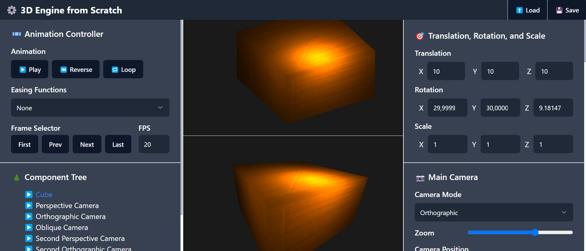
<br></br>

3D Engine from scratch merupakan sebuah aplikasi ini dibuat sebagai cara tim pengembang untuk mengenal lebih lanjut terkait penggunaan WebGL dan GLSL dalam pembuatan game 3D. Aplikasi ini dibuat menggunakan Next.js sebagai *frontend framework* dan WebGL murni tanpa menggunakan *library* lain apapun. Aplikasi ini menyimulasikan *3D engine* yang dapat menampilkan objek 3D melalui kamera beserta efek tesktur dan cahaya.

## 📝 Daftar Isi
- [Informasi General](#informasi-general)
- [Komponen Utama](#komponen-utama)
- [Cara Menjalanakan Aplikasi](#cara-menjalanakan-aplikasi)
- [Panduan Penggunaan Aplikasi](#panduan-penggunaan-aplikasi)
- [Pembagian Tugas](#pembagian-tugas)

## 📢 Informasi General
Tugas besar ini akan menjadi lanjutan pengenalan terhadap dunia grafika komputer dan melihatkan secara konkrit bagaimana permainan video tiga dimensi yang sering kamu mainkan itu di-render dalam layar monitor dua dimensi. Target platform yang akan digunakan adalah WebGL. Berikut adalah cakupan materi yang akan digunakan pada tubes ini, meliputi WebGL 3D, *Transformations*, *Scene Graph*, *Geometry*, *Materials*, *Projections* (Camera), *Light Shading* (Blinn-Phong), *Input* and *Output*.

## 🔎 Komponen Utama
Pada dasarnya, struktur 3D engine terdiri dari objek-objek high-level yang saling melengkapi untuk membuat sebuah gambar grafika komputer. Ada beberapa objek-objek yang biasa dimiliki oleh 3D engine:
1. **Scene** merupakan hirarki dari *nodes* yang mendefinisikan *scene graph*.
2. **Mesh** merupakan objek tiga dimensi yang tampak di scene. Setiap *mesh* idealnya dapat memiliki satu atau lebih material, implementasi satu material untuk satu mesh saja. Mesh memiliki *geometry*.
3. **Geometry** memberikan deskripsi atribut (sama halnya dengan *attribute* pada WebGL) dari objek.
4. **Material** memberi penampilan dari objek. Biasanya diimplementasikan sebagai uniform atau sampler (untuk tekstur) pada WebGL.
5. **Animation** mendeskripsikan bagaimana objek 3D ditransformasikan seiring waktu.
6. **Skins** memberitahukan bagaimana cara geometri dari objek dideformasikan berdasarkan pose dari skeleton.
7. **Camera** menunjukkan konfigurasi tampilan untuk renderer.
8. **Renderer** mengkombinasikan objek-objek high-level dalam 3D engine menjadi state yang akan dijalankan oleh graphics library seperti WebGL.

## ⚙️ Cara Menjalanakan Aplikasi
1. *Clone repository* ini dengan menjalankan perintah berikut.
    ```bash
    $ git clone https://github.com/GAIB20/tugas-besar-grafkom-2-sabeb
    ```
2. Masuk ke direktori hasil *clone repository* dengan menjalankan perintah berikut.
    ```bash
    $ cd tugas-besar-grafkom-2-sabeb
    ```
3. Install *dependencies* yang dibutuhkan dengan menjalankan perintah 
    ```bash
    $ npm install
    ```
4. Jalankan aplikasi dengan menjalankan perintah 
    ```bash
    $ npm run dev
    ```
5. Buka browser dan akses `http://localhost:3000`

## 📝 Panduan Penggunaan Aplikasi
Halaman utama aplikasi terdiri atas beberapa *section*:

<table style="width:100%; text-align:center;">
    <col width="100%">
    <tr>
        <td width="1%" align="center">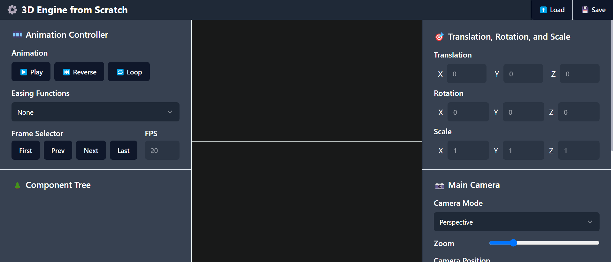</td>
    </tr>
    <tr>
        <td width="1%" align="center">Halaman Utama Aplikasi</td>
    </tr>
</table>

1. *Header section* yang berada di bagian atas halaman, memiliki tombol *load* dan *save* file dengan ekstensi .gltf. Kedua tombol ini digunakan untuk melakukan *load* scene 3D yang pernah dibuat atau menyimpan scene 3D yang sedang ditampilkan.

2. *Left-sidebar* yang berada di bagian kiri halaman, memiliki *animation controller* dan *component tree*. *Animation controller* digunakan untuk mengatur animasi yang ada pada objek 3D yang sedang ditampilkan. *Component tree* digunakan untuk melihat struktur *tree* dari objek 3D yang sedang ditampilkan beserta objek-objek lain yang ada di dalam *scene* (termasuk kamera dan cahaya).

3. *Right-sidebar* yang berada di bagian kanan halaman, memiliki berbagai kontrol untuk transformasi objek; properti kamera utama dan kamera sekunder; pilihan shader; serta properti cahaya, material, dan tekstur.

Pengguna dapat menekan tombol *load* dan memilih salah satu model yang ada di dalam folder `test`. Dalam panduan ini, digunakan CubeModel.gltf. Setelah model berhasil dimuat, model akan muncul pada kedua canvas.

<table style="width:100%; text-align:center;">
    <col width="49%">
    <col width="49%">
    <tr>
        <td width="1%" align="center">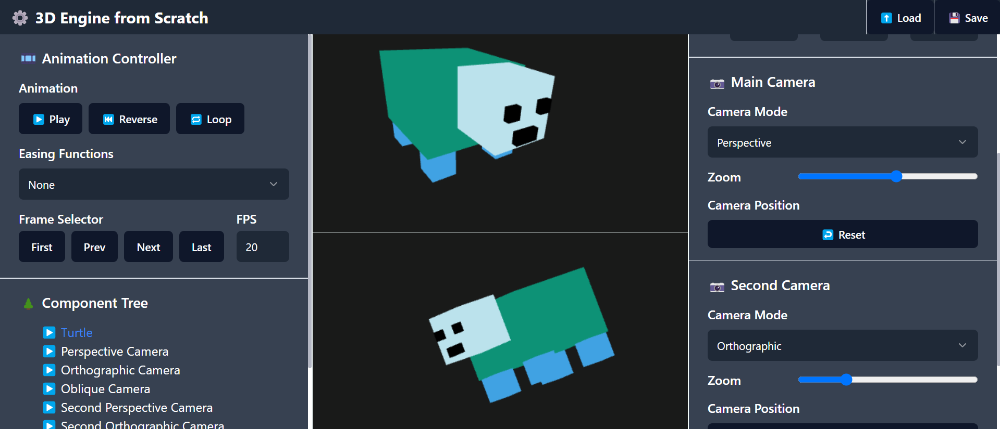</td>
        <td width="1%" align="center">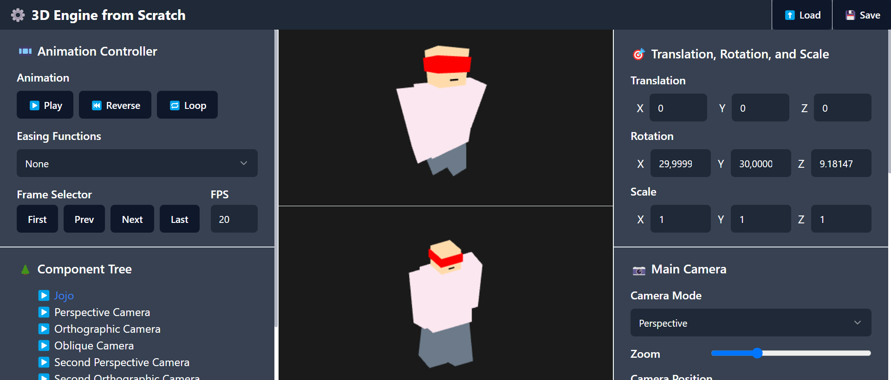</td>
    </tr>
    <tr>
        <td width="1%" align="center">Hasil Articulated Model MarthenModel.gltf</td>
        <td width="1%" align="center">Hasil Articulated Model JojoModel.gltf</td>
    </tr>
    <tr>
        <td width="1%" align="center">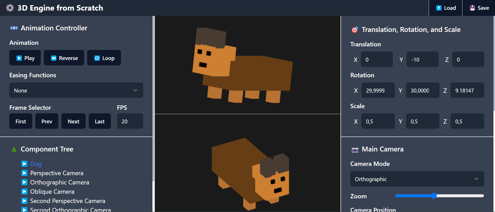</td>
        <td width="1%" align="center">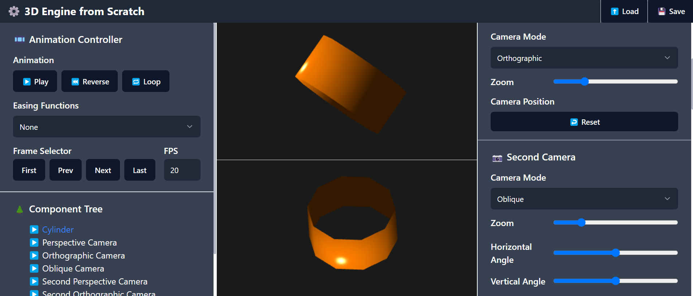</td>
    </tr>
    <tr>
        <td width="1%" align="center">Hasil Articulated Model LeonModel.gltf</td>
        <td width="1%" align="center">Hasil Hollow Object Model HollowMarthenModel.gltf</td>
    </tr>
    <tr>
        <td width="1%" align="center">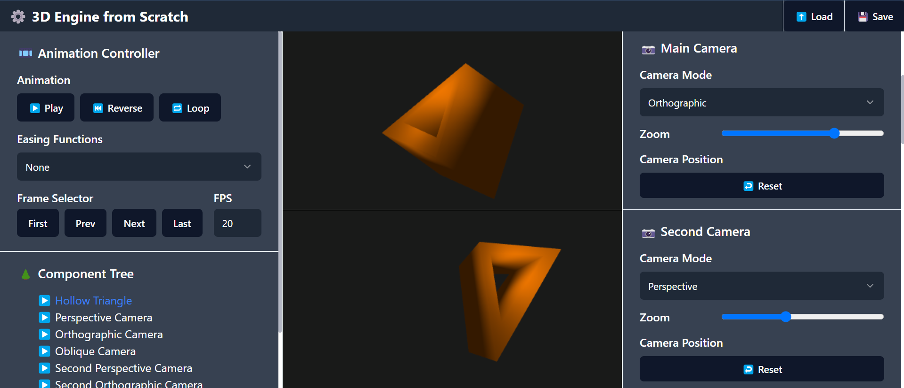</td>
        <td width="1%" align="center">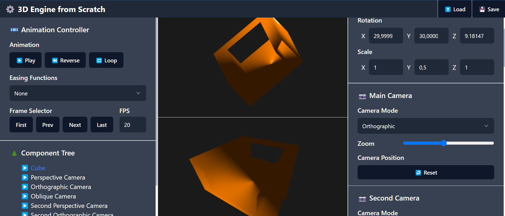</td>
    </tr>
    <tr>
        <td width="1%" align="center">Hasil Hollow Object Model HollowJojoModel.gltf</td>
        <td width="1%" align="center">Hasil Hollow Object Model HollowLeonModel.gltf</td>
    </tr>
    <tr>
        <td width="1%" align="center">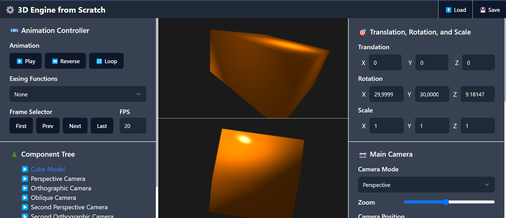</td>
        <td width="1%" align="center">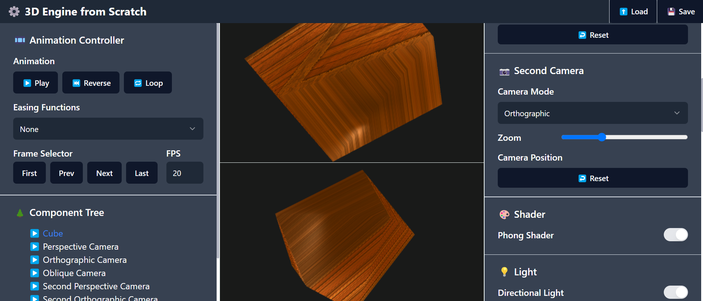</td>
    </tr>
    <tr>
        <td width="1%" align="center">Hasil Model BaseCubeModel.gltf</td>
        <td width="1%" align="center">Hasil Model CubeModel.gltf</td>
    </tr>
</table>

Secara *default*, objek utama yang ditampilkan akan dijadikan objek yang sedang dipilih. Transformasi objek yang sedang dipilih dapat diubah melalui *right-sidebar*. Pengguna dapat memilih objek lain dengan menekan nama objek yang ada di *component tree*. Pengguna juga dapat meng-*expand* struktur objek dengan menekan tombol panah di sebelah kiri nama objek pada *component tree* tersebut. (Digunakan model **MarthenModel.gltf** dan **LeonModel.gltf** untuk memperlihatkan _component tree_ yang lebih jelas karena CubeModel.gltf bukanlah _articulated model_)

<table style="width:100%; text-align:center;">
    <col width="49%">
    <col width="49%">
    <tr>
        <td width="1%" align="center">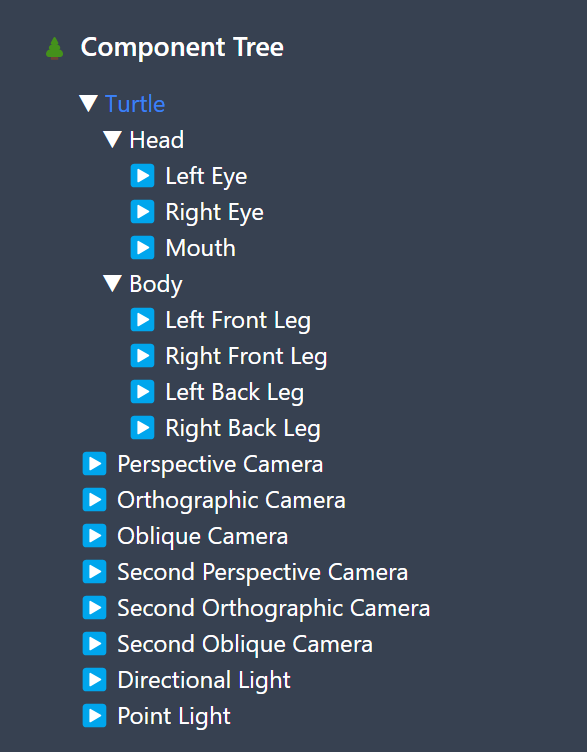</td>
        <td width="1%" align="center">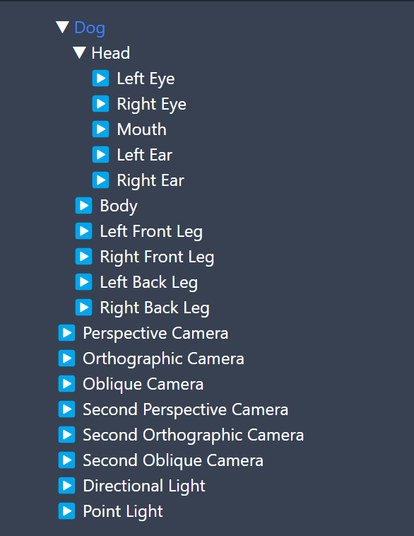</td>
    </tr>
    <tr>
        <td width="1%" align="center">Struktur tree Model MarthenModel.gltf</td>
        <td width="1%" align="center">Struktur tree Model LeonModel.gltf</td>
    </tr>
</table>

Kamera pada kedua canvas secara *default* mengarah ke objek yang sedang dipilih. Namun, ketika dilakukan translasi pada objek yang sedang dipilih, kamera tidak mengikuti objek tersebut. Pengguna dapat membuat kamera untuk kembali focus pada objek yang sedang dipilih dengan menekan kembali objek tersebut pada *component tree*. Untuk mengembalikan kamera ke posisi semula, pengguna dapat menekan tombol reset kamera yang berada di *right-sidebar*.

<table style="width:100%; text-align:center;">
    <col width="100%">
    <tr>
        <td width="1%" align="center">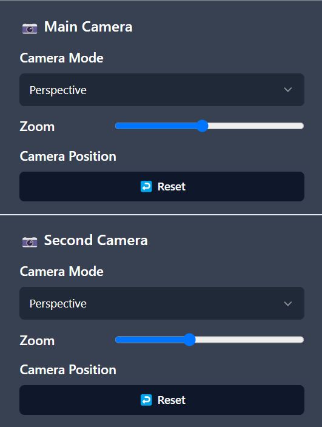</td>
    </tr>
    <tr>
        <td width="1%" align="center">Pengaturan Kamera</td>
    </tr>
</table>

Pengguna tidak dapat mengubah transformasi objek kamera secara manual. Untuk mengubah orientasi kamera, pengguna dapat menahan klik-kiri dan kemudian menggeser mouse pada salah satu canvas. Kamera akan bergerak dengan orbit tertentu yang mengelilingi objek yang sedang dipilih. Untuk bergerak menjauhi atau mendekati objek yang sedang dipilih, pengguna dapat menggunakan scroll pada mouse.

<table style="width:100%; text-align:center;">
    <col width="49%">
    <col width="49%">
    <tr>
        <td width="1%" align="center">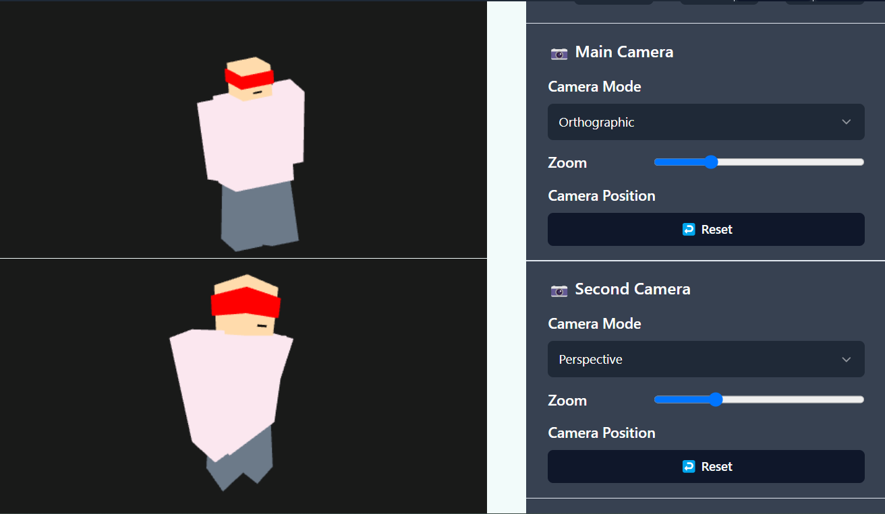</td>
        <td width="1%" align="center">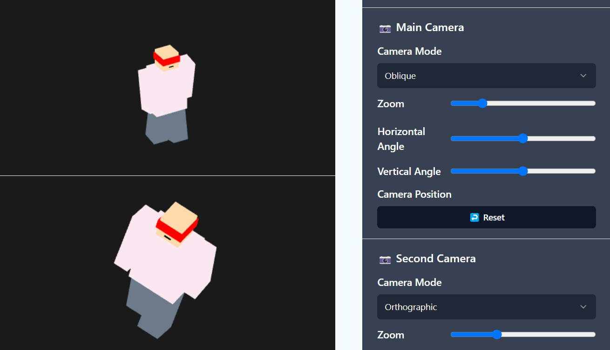</td>
    </tr>
    <tr>
        <td width="1%" align="center">Gambar kamera awal</td>
        <td width="1%" align="center">Gambar kamera setelah digeser</td>
    </tr>
</table>

Mode kamera secara *default* adalah *perspective*. Pengguna dapat mengubah mode kamera menjadi *orthographic* atau *oblique* dengan *dropdown* yang ada di *right-sidebar*. Pengguna juga dapat mengubah zoom kamera di sana. Khusus untuk kamera *oblique*, terdapat parameter tambahan berupa sudut *oblique* yang dapat diubah oleh pengguna.

<table style="width:100%; text-align:center;">
    <col width="100%">
    <tr>
        <td width="1%" align="center">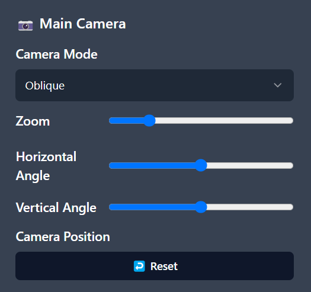</td>
    </tr>
    <tr>
        <td width="1%" align="center">Kamera mode oblique</td>
    </tr>
</table>

Secara *default*, aplikasi menggunakan *basic shader* untuk menampilkan objek sehingga tidak ada efek cahaya yang terlihat. Pengguna dapat mengubah shader yang digunakan dengan mengubah *toggle* pada segmen *shader* di *right-sidebar*. Ketika *phong shader* dinyalakan, aplikasi akan menampilkan objek dengan efek cahaya yang lebih realistis.

<table style="width:100%; text-align:center;">
    <col width="49%">
    <col width="49%">
    <tr>
        <td width="1%" align="center">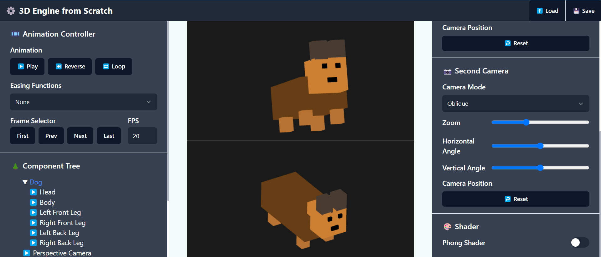</td>
        <td width="1%" align="center">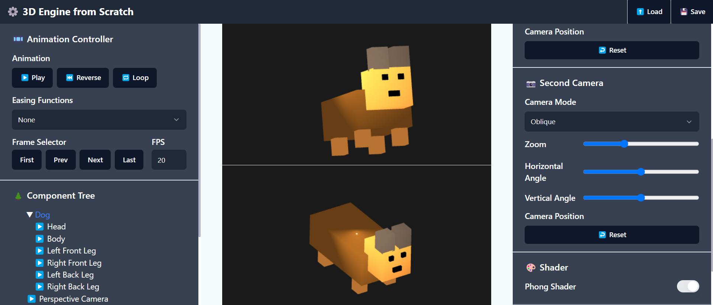</td>
    </tr>
    <tr>
        <td width="1%" align="center">Hasil dengan Basic Shader</td>
        <td width="1%" align="center">Hasil dengan Phong Shader</td>
    </tr>
</table>

Ketika *phong shader* dinyalakan, aplikasi akan menampilkan beberapa properti tambahan untuk cahaya, material, dan tekstur terhadap objek yang sedang dipilih. Pengguna dapat memilih untuk mengaktifkan atau mematikan *directional light* dan *point light* pada scene yang sedang ditampilkan dengan menggunakan *toggle* pada segmen *light* di *right-sidebar*. *Point light* memiliki properti tambahan berupa parameter untuk *attenuation*. Pengguna juga dapat mengubah transformasi objek yang berperan sebagai cahaya dengan memilih objek tersebut pada *component tree*. Namun, aplikasi belum memungkinkan pengguna untuk mengubah arah *directional light* secara manual.

<table style="width:100%; text-align:center;">
    <col width="100%">
    <tr>
        <td width="1%" align="center"></td>
    </tr>
    <tr>
        <td width="1%" align="center">Pengaturan cahaya</td>
    </tr>
</table>

Pengguna dapat mengubah properti material objek yang sedang dipilih pada segmen *material* di *right-sidebar*. Pada saat menggunakan *basic shader*, pengguna hanya dapat mengubah warna objek. Namun, ketika menggunakan *phong shader*, pengguna dapat mengubah warna *ambient*, *diffuse*, dan *specular* objek. Selain itu, pengguna juga dapat mengubah atribut *shininess* objek.

<table style="width:100%; text-align:center;">
    <col width="100%">
    <tr>
        <td width="1%" align="center"></td>
    </tr>
    <tr>
        <td width="1%" align="center">Pengaturan material</td>
    </tr>
</table>

*Phong shader* juga memungkinkan pengguna untuk memilih tekstur yang akan digunakan pada objek yang sedang dipilih. Aplikasi menyediakan *dropdown* untuk pemilihan tesktur *diffuse*, *specular*, *normal*, dan *displacement*. Untuk masing-masing tekstur, disediakan 3 pilihan yang dapat digunakan pada objek utama. Khusus untuk *displacement*, terdapat juga parameter *scale* dan *bias* yang dapat diubah pengguna. Secara *default*, objek tidak menggunakan tekstur apapun.

<table style="width:100%; text-align:center;">
    <col width="100%">
    <tr>
        <td width="1%" align="center">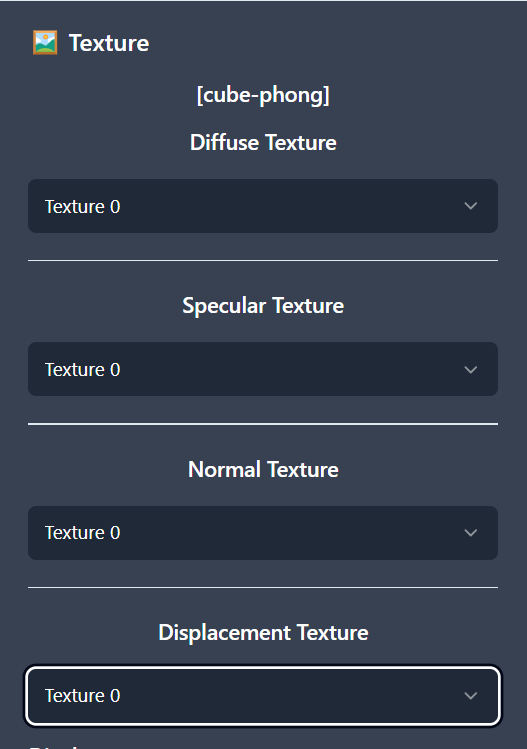</td>
    </tr>
    <tr>
        <td width="1%" align="center">Pengaturan tekstur</td>
    </tr>
</table>

*Animation controller* memungkinkan pengguna untuk memiliki kontrol atas animasi yang telah disematkan pada model yang dibuat. Aplikasi menyediakan *controller* sederhana yang terdiri atas *play, reverse,*, dan *loop toggle* sehingga animasi dapat dimainkan, dijalankan mundur, dan diulang. Selain itu, pengguna dapat memilih jenis *easing functions* pada *tweening* animasi (perlu diperhatikan bahwa *tweening* sangat *minor* efeknya karena pemanggilan *method update* yang terlalu sering). Pengguna juga dapat melihat animasi secara mendetail menggunakan tombol *first, prev, next,* dan *last* untuk melihat detail dari setiap *frame* animasi. Terakhir, pengguna dapat mengubah *fps* dari animasi dengan mengubah nilai dari *input* yang disediakan.

## 👨‍👨‍👦‍👦 Pembagian Tugas
|NIM|Nama| Tugas                                                                                                                                                                                                        |Model *Articulated* dan Animasinya|Model *Hollow* dan Animasinya
|-|-|--------------------------------------------------------------------------------------------------------------------------------------------------------------------------------------------------------------|-|-|
|13521108|Michael Leon Putra Widhi| [tambahin sendiri]                                                                                                                                                                                           |LeonModel|HollowLeonModel|
|13521117|Maggie Zeta Rosida S| *No contribution*                                                                                                                                                                                            |MaggieModel|*No Contribution*|
|13521144|Bintang Dwi Marthen| Animation; Tweening; Normal Texture; UI integration                                                                                                                                                          |MarthenModel|HollowMarthenModel|
|13521148|Johanes Lee| *GLTF data classes; math classes (matrix, vector, quaternion); mesh; model framework; file export and import; GL utilities; rendering; orthographic and oblique camera; displacement texture; UI integration* |JojoModel|HollowJojoModel|
